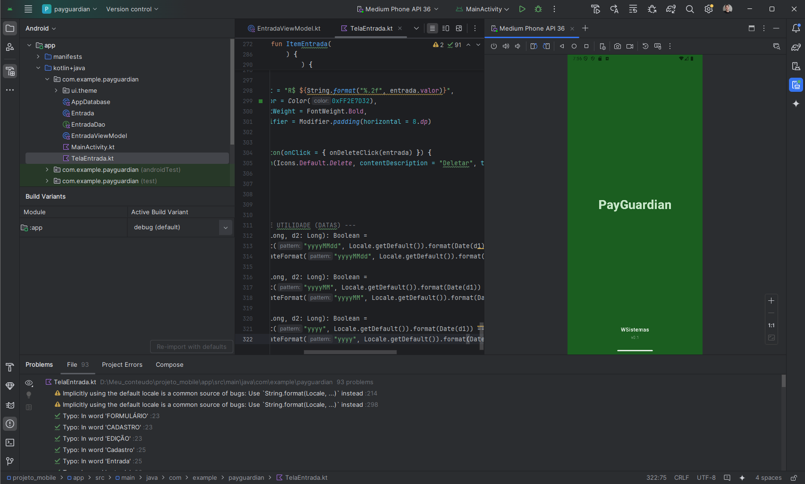
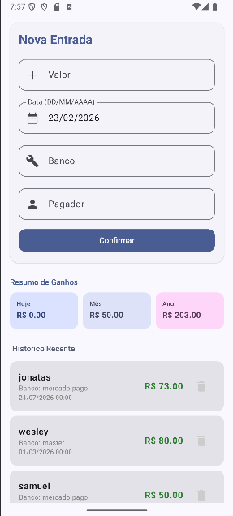
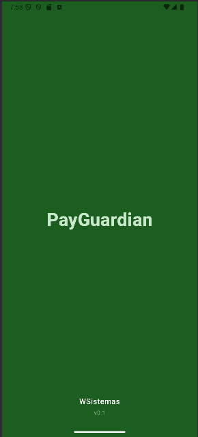

# 
🛡️ PayGuardian — WSistemas

PayGuardian
O PayGuardian é um sistema de gestão financeira pessoal focado no registo e monitorização de entradas de capital. Este projeto foi desenvolvido como parte dos meus estudos iniciais na linguagem Kotlin e no ambiente Android Studio, aplicando conceitos de arquitetura moderna e persistência de dados.

Apesar de possuir experiência prévia com Java SE e preferência atual por tecnologias Web (JS e PHP), este projeto serviu para aprofundar conhecimentos no ecossistema mobile nativo.

🖼️ Interface do Sistema
<table width="100%">
<tr>
<td align="center" width="33%">
<b>Tela de Entradas</b>

</td>
<td align="center" width="33%">
<b>Gestão de Dados</b>

</td>
<td align="center" width="33%">
<b>Detalhamento</b>

</td>
</tr>
</table>

🏗️ Estrutura Analítica do Sistema
O projeto segue uma estrutura modular para facilitar a manutenção e escalabilidade, dividindo responsabilidades entre lógica de dados, interface e visão.

<h3 style="color: #77d7ff; margin-top: 0;">📂 Estrutura de Diretórios</h3>
<ol>
<li style="margin-bottom: 10px;">
<code style="color: #ff7b72; font-weight: bold;">payguardian/</code> — Raiz do aplicativo Android.
<ul>
<li>
<code style="color: #79c0ff;">payguardian/</code> — <b>Core do App</b>
<ul>
<li><code>AppDatabase.kt</code> — Configuração central do Banco de Dados Room.</li>
<li><code>Entrada.kt</code> — Entidade de dados (Model).</li>
<li><code>EntradaDao.kt</code> — Interface de acesso aos dados (Queries).</li>
<li><code>EntradaViewModel.kt</code> — Lógica de negócio e estado da UI.</li>
<li><code>TelaEntrada.kt</code> — Componentes de interface (Compose).</li>
</ul>
</li>
<li>
<code style="color: #79c0ff;">ui/theme/</code> — <b>Identidade Visual</b>
<ul>
<li><code>Color.kt</code> | <code>Theme.kt</code> | <code>Type.kt</code> — Definições de estilo.</li>
</ul>
</li>
<li>
<code style="color: #79c0ff;">prints/</code> — <b>Documentação Visual</b>
<ul>
<li>Galeria de capturas de tela do app funcional.</li>
</ul>
</li>
<li>
<code style="color: #d2a8ff;">PayguardianAPK.zip</code> — Arquivo binário pronto para instalação.
</li>
</ul>
</li>
</ol>

Arquitetura do Projeto
O aplicativo foi estruturado utilizando o padrão MVVM (Model-View-ViewModel), garantindo a separação entre a interface do utilizador, a lógica de negócio e o armazenamento de dados.

Model: Representado pela entidade Entrada, define a estrutura dos dados guardados no banco de dados local SQLite.

View: Construída inteiramente com Jetpack Compose, utilizando componentes reativos para uma interface moderna e fluida.

ViewModel: Responsável por gerir os estados da UI e coordenar as operações assíncronas com o banco de dados através de Coroutines e Flow.

Tecnologias e Bibliotecas
Jetpack Compose: Para a construção de uma interface declarativa.

Room Database: Biblioteca de abstração para persistência de dados local.

Kotlin Coroutines/Flow: Para processamento de dados em segundo plano e atualizações em tempo real na interface.

Material Design 3: Implementação de temas e componentes visuais modernos.

🛠️ Tecnologias e Implementação
Kotlin: Linguagem principal, escolhida pela sua robustez e segurança de tipos.

Jetpack Compose: Utilizado para a construção de uma interface moderna, declarativa e fluida.

Room Database (SQLite): Implementado para garantir a persistência local dos dados com uma camada de abstração segura.

ViewModel & LiveData: Utilizados para manter a integridade dos dados durante as mudanças de ciclo de vida do aplicativo.

Material Design 3: Aplicado para garantir uma experiência de usuário (UX) padronizada e intuitiva.

Estruturação de Dados
A entidade principal do sistema, Entrada, utiliza as seguintes variáveis para o controlo financeiro:

id: Identificador único gerado automaticamente pelo banco de dados.

valor: Armazena o montante financeiro da transação (Double).

banco: Identifica a instituição de destino do depósito (String).

nomePessoa: Regista a origem ou o pagador da entrada (String).

data: Armazenada como Long (Timestamp), permitindo a ordenação cronológica e cálculos de soma por períodos.

Funcionamento e Funcionalidades
O sistema oferece um fluxo completo de gestão de dados (CRUD) e análise visual:

Splash Screen Personalizada: Tela de abertura com a marca WSistemas, gerida por um temporizador para carregamento inicial do sistema.

Registo com Validação: O formulário de cadastro impede a inserção de campos vazios ou valores zerados, garantindo a integridade do histórico.

Máscara de Data Manual: Campo de texto com formatação automática (DD/MM/AAAA) que permite ao utilizador inserir datas retroativas com segurança.

Dashboard de Ganhos: Filtros lógicos aplicados sobre a base de dados para exibir somas automáticas dos ganhos do Dia, do Mês e do Ano.

Edição e Exclusão: Interface interativa que permite selecionar um registo para correção ou remoção definitiva do banco de dados.

Estado Reativo: Se a lista estiver vazia, o sistema apresenta um aviso visual amigável em vez de um espaço em branco, melhorando a experiência do utilizador.

Camada de Dados (DAO)
A interface EntradaDao contém a lógica de acesso ao banco de dados, utilizando consultas SQL otimizadas para retornar fluxos de dados em tempo real:

Ordenação automática por data (mais recente primeiro).

Cálculo de soma por períodos através da cláusula BETWEEN do SQL.

🚀 Como Utilizar
Clone o repositório.

Abra o projeto no Android Studio.

Certifique-se de ter o SDK do Android atualizado para suporte ao Jetpack Compose.

Execute o projeto em um emulador ou dispositivo físico.

Caso prefira, instale diretamente via APK disponível na pasta raiz.

<b>Desenvolvido por WSistemas</b>

<i>(Wesley Samuel Ferreira Rodrigues)</i>

